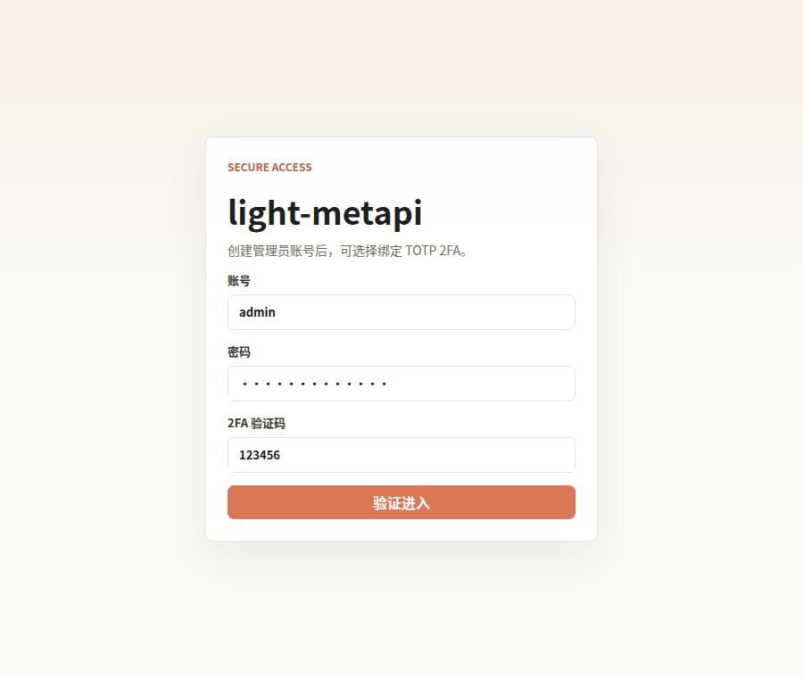
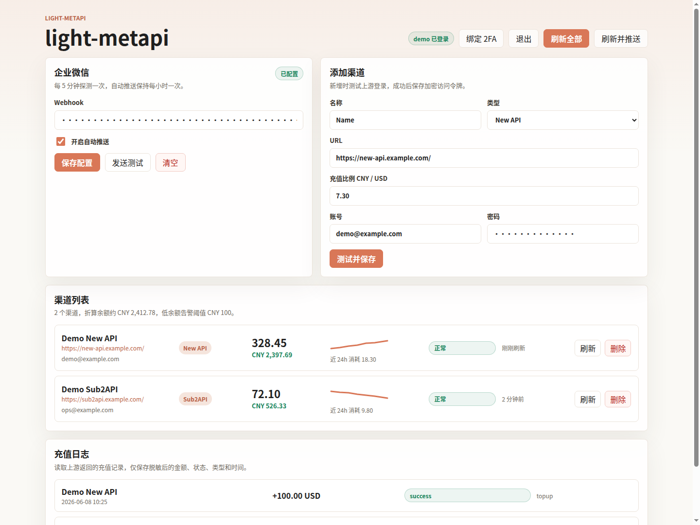

# light-metapi

light-metapi 是一个轻量上游余额监控工具，当前支持 New API 和 Sub2API。它可以统一维护不同上游渠道的余额、充值记录和企业微信告警，适合 AI API 中转业务做低成本自动巡检。

[English README](README.md) | [引用说明](CITATION.md)

CY16 的受审核部署、自动回滚和员工权限流程见 [CY16 安全部署手册](DEPLOYMENT.md)。

## 效果预览





## 功能

- 首次打开创建管理员账号，可选择绑定 TOTP 2FA。
- 支持 New API 和 Sub2API 上游余额刷新。
- 添加渠道时先测试登录，成功后保存。
- 上游访问令牌加密存储，企业微信 webhook 加密存储。
- 充值日志读取上游自身接口。
- 企业微信每小时汇总推送。
- 折算 CNY 余额低于阈值时发送告警。
- SQLite 数据库，Docker 单服务部署。
- OpenCode Go 多账号额度子页，读取 5 小时、每周、每月三个窗口，并折算为美元池余额。
- OpenCode Go Cookie 与 API Key 复用现有加密存储和管理员登录。
- OpenCode Go 池剩余低于阈值时复用企业微信、飞书和邮件告警（默认 5 小时 &lt; $20、每周 &lt; $80、每月 &lt; $300）。

## 快速运行

```bash
python3 -m venv .venv
source .venv/bin/activate
pip install -r requirements.txt
python3 app.py
```

默认监听 `127.0.0.1:8756`。

Docker:

```bash
docker compose up -d --build
```

`docker-compose.yml` 默认绑定 `127.0.0.1:8756`，适合放在 HTTPS 反向代理后面使用。容器硬内存上限为 512 MiB、内存预留为 192 MiB、交换区总上限为 768 MiB，并限制最多 128 个进程。

## 使用方式

1. 打开页面，创建管理员账号。
2. 登录后按需绑定 TOTP 2FA。
3. 在企业微信区域配置机器人 webhook。
4. 在添加渠道区域选择 New API 或 Sub2API，填写 URL、账号、密码和汇率。
5. 点击“测试并保存”，测试成功后进入渠道列表。
6. 系统按间隔刷新余额，并按配置推送企业微信消息。

## 数据与安全

- SQLite 数据库：`data/upstreams.sqlite3`
- 加密密钥：`data/secret.key`
- Session 密钥：`data/session.secret`
- OpenCode Go 账号：`opencode_accounts` 表，Cookie 与 API Key 使用 `data/secret.key` 加密。

从独立 OpenCode Go 看板迁移时，可以把原 `config.json` 临时复制为
`data/opencode-import.json`。服务首次启动会导入账号、加密凭据并立即删除这个明文导入文件。

添加渠道时，系统会使用提交的上游账号密码完成一次登录测试。测试成功后，本地保存加密后的上游访问令牌，并清空密码字段。企业微信 webhook 使用本机密钥加密后存储。

充值日志读取上游自身接口：

- New API：`/api/user/topup/self`
- Sub2API：`/api/v1/payment/orders/my`

本地充值日志只保存金额、状态、类型、时间和哈希后的来源引用。

## 自动化策略

- 每 5 分钟探测一次余额。
- 保留 72 小时余额历史。
- 企业微信汇总默认每小时一次。
- 折算 CNY 余额低于 100 时发送企业微信告警。
- 同一渠道低余额告警默认 6 小时冷却一次。

## 环境变量

| 变量 | 默认值 | 用途 |
| --- | --- | --- |
| `HOST` | `127.0.0.1` | 本地运行时监听地址 |
| `PORT` | `8756` | 服务端口 |
| `REFRESH_INTERVAL_SECONDS` | `300` | 余额刷新间隔 |
| `NOTIFY_INTERVAL_SECONDS` | `3600` | 企业微信汇总推送间隔 |
| `HISTORY_RETENTION_HOURS` | `72` | 余额历史保留时间 |
| `DEFAULT_CNY_RATE` | `7.3` | 默认 CNY/USD 折算汇率 |
| `LOW_BALANCE_ALERT_CNY` | `100` | 低余额告警阈值 |
| `LOW_BALANCE_ALERT_COOLDOWN_SECONDS` | `21600` | 单渠道告警冷却时间 |
| `UPSTREAM_REQUEST_TIMEOUT` | `25` | 上游请求超时时间 |
| `OPENCODE_GO_ALERT_INTERVAL_SECONDS` | `60` | OpenCode Go 告警检查间隔 |
| `OPENCODE_GO_ALERT_THRESHOLDS` | `20,5,0` | 兼容保留的单账号剩余百分比告警线（默认关闭） |
| `OPENCODE_GO_POOL_ALERT_USD` | `rolling=20,weekly=80,monthly=300` | OpenCode Go 池剩余美元告警线 |
| `OPENCODE_GO_REFRESH_DEADLINE_SECONDS` | `90` | 一次多账号刷新整体等待上限，超时后返回部分结果 |
| `OPENCODE_GO_REFRESH_WORKERS` | `16` | OpenCode Go 并发刷新线程数 |
| `OPENCODE_GO_IMPORT_FILE` | `data/opencode-import.json` | 一次性明文迁移文件，成功处理后自动删除 |

## 接口

- `GET /api/auth/bootstrap`
- `POST /api/auth/register`
- `POST /api/auth/login`
- `POST /api/auth/logout`
- `POST /api/auth/2fa/setup`
- `POST /api/auth/2fa/confirm`
- `GET /api/channels`
- `POST /api/channels`
- `PUT /api/channels/:id`
- `DELETE /api/channels/:id`
- `POST /api/channels/:id/refresh`
- `POST /api/refresh`
- `GET /api/recharges`
- `GET /api/settings`
- `PUT /api/settings`
- `GET /api/opencode/accounts`
- `POST /api/opencode/accounts`
- `PUT /api/opencode/accounts/:id`
- `DELETE /api/opencode/accounts/:id`
- `POST /api/opencode/refresh`
- `GET /api/opencode/alerts`
- `POST /api/opencode/alerts/test`
